# Machine_leaning

### PHASE 3 PROJECT
    Student : Milton Kabute
    Date : 10th March 2024

# **Customer Churning Project**
## Predict Customer Churn for Syriatel Telcommunication Company

## **Business Understanding**

### **Background**
SyriaTel, a telecommunications company, provides various services such as mobile, internet, and landline to its customers.
Customer churn, or the rate at which customers cease their relationship with SyriaTel, poses a significant challenge as it directly impacts the company's revenue and profitability.
Identifying and predicting churn patterns is crucial for SyriaTel to proactively address customer attrition, retain valuable customers, and maximize long-term profitability.

### **Objective**
Develop a predictive model that can accurately identify customers at risk of churning from SyriaTel's services.
By predicting churn in advance, SyriaTel can implement targeted retention strategies to mitigate customer attrition, improve customer satisfaction, and enhance overall business performance.

### **Stakeholders**
    -Senior Management
    -Marketing Team
    -Customer Service Reps
    -Investors
    -Communication Regulation Bodies
    -Sales Teams
    -Finance and Accounting Team
    -Product Development Team
    -Social Media Team

### Key Objectives
    What factors contribute to customer churn within SyriaTel's customer base?
    Are there identifiable patterns or trends in customer behavior that precede churn?
    How accurately can we predict which customers are likely to churn in the near future?
    What proactive measures can SyriaTel take to retain at-risk customers and minimize churn rates?
### Data Description
The dataset in Syriatel encompasses the following features
    State: Customer's state of residence

    Account Length: Number of days with the telecom company

    Area Code: Area code of the customer's phone number

    International Plan: Whether the customer has an international calling plan

    Voice Mail Plan: Whether the customer has a voice mail plan .

    Number of Voicemail Messages: Count of voicemail messages received

    Total Day Minutes: Total minutes used during the daytime

    Total Day Calls: Total number of calls made during the daytime

    Total Day Charge: Total charges for daytime usage

    Total Evening Minutes: Total minutes used during the evening

    Total Evening Calls: Total number of calls made during the evening

    Total Evening Charge: Total charges for evening usage

    Total Night Minutes: Total minutes used during the night

    Total Night Calls: Total number of calls made during the night

    Total Night Charge: Total charges for nighttime usage

    Total International Minutes: Total international minutes used

    Total International Calls: Total international calls made

    Total International Charge: Total charges for international usage

    Customer Service Calls: Number of customer service calls made

    Churn: Indicates whether the customer has churned
    
### Model Success
The model ability to accurately predict customer churn as measured on perfromance metrics such as accuracy, precision, recall, and F1-score. In addition, compare the model to baseline models and provide actionable insights to impliment customer retention stategies.

### Distribution of the data in the dataset

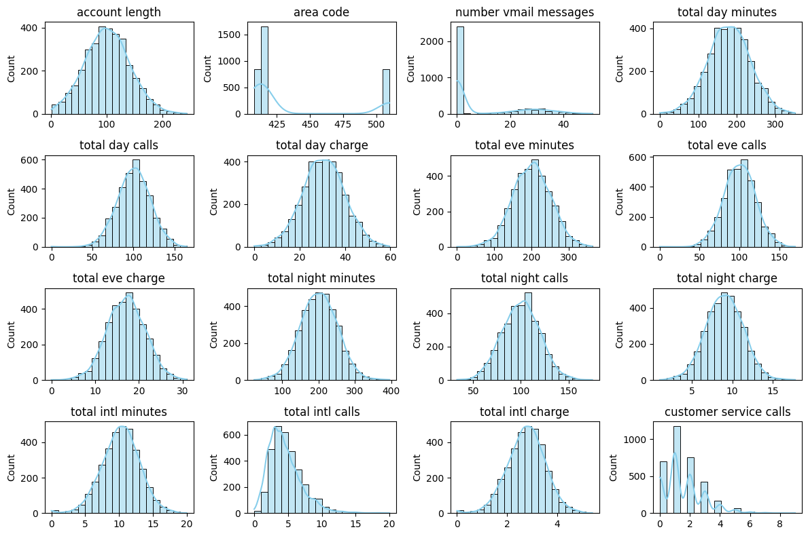

### Scatterplots Numerical variables vs Churn
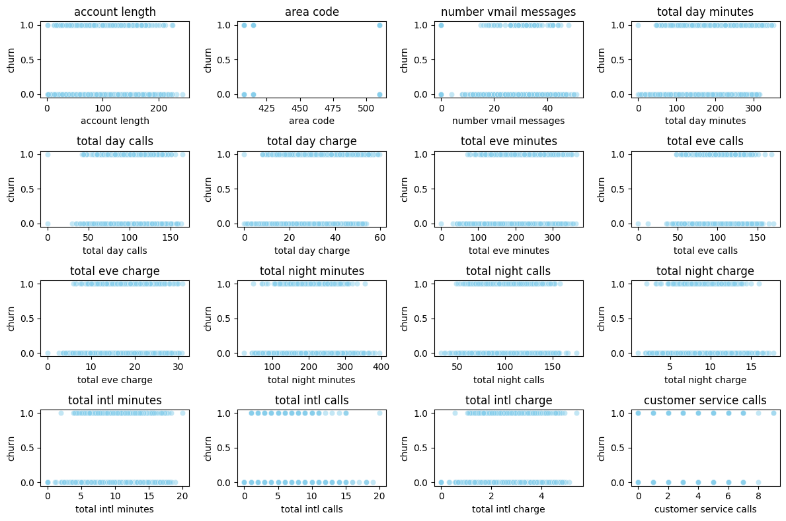

### Correlation Heatmap
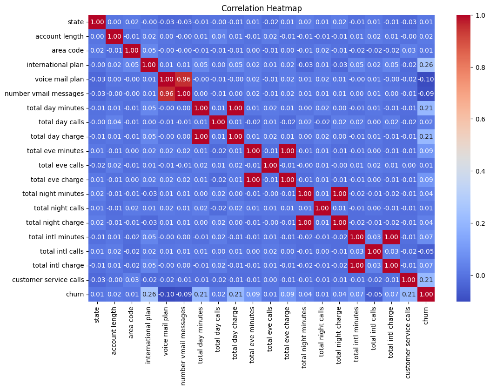

## Scatterplot
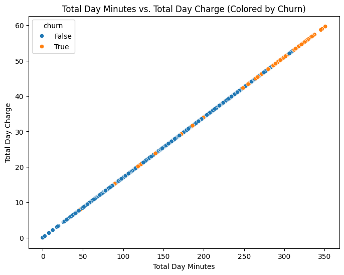

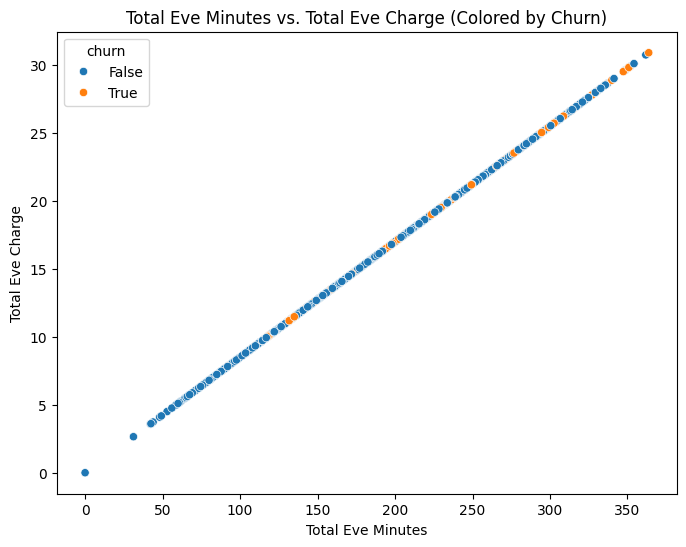

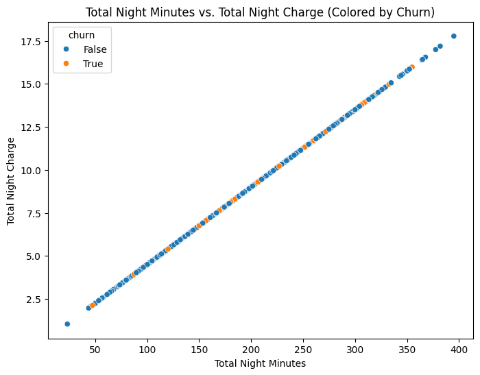

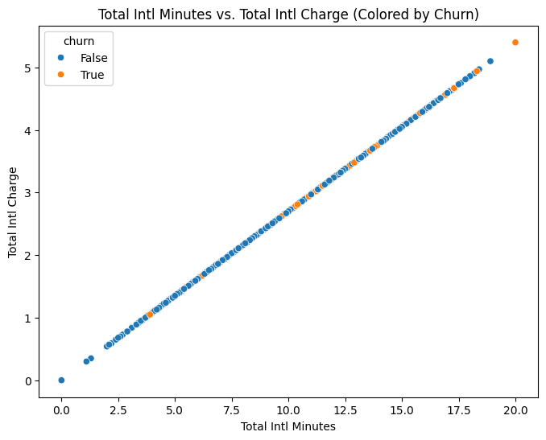

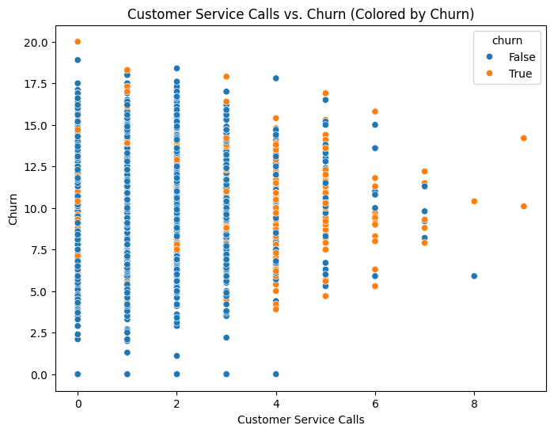

## Distribution of Variables and Churn Status
 
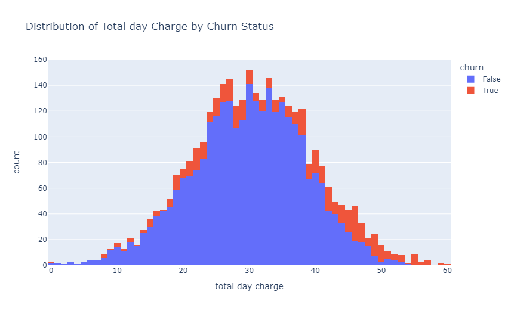

.png>)

.png>)

.png>)

.png>)

## Churn Status

.png>)

## Gradient Boosting Classifier

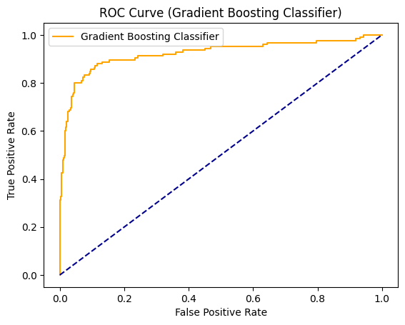
## Random Forest Classifier
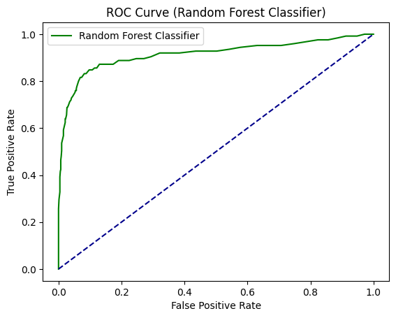
## SVM 
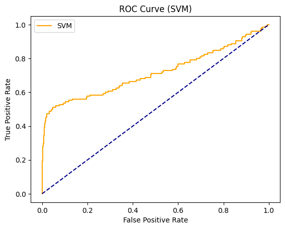

## Decision Tree
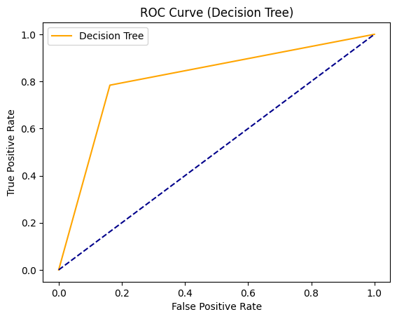

## KNN Classifier
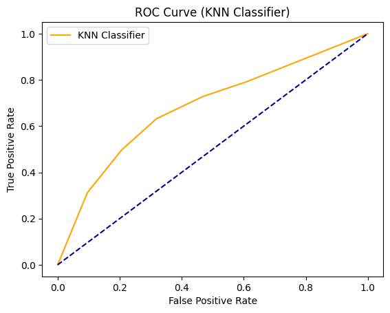

## Logistic Regression
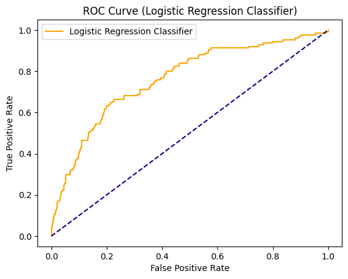

## Classification Model Results
 Classifier  Accuracy  Precision  Recall  F1-Score
0    Gradient Boosting  0.931655   0.761538   0.792  0.776471
1        Random Forest  0.926859   0.780702   0.712  0.744770
3        Decision Tree  0.829736   0.460094   0.784  0.579882
2                  SVM  0.835731   0.459459   0.544  0.498168
5  Logistic Regression  0.690647   0.280528   0.680  0.397196
4                  KNN  0.673861   0.259016   0.632  0.367442

## Confusion Matrix
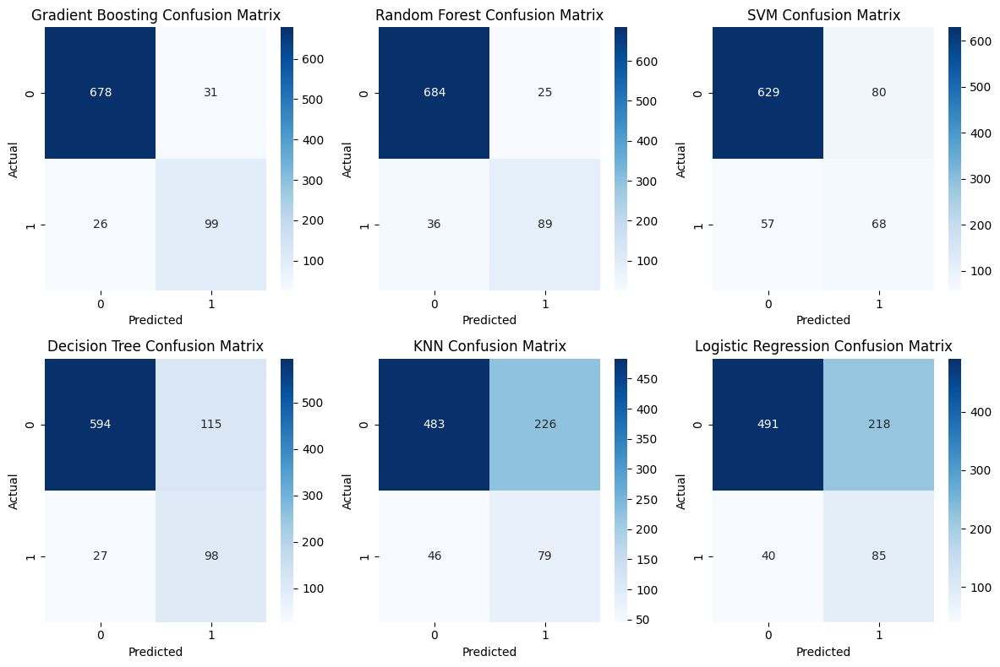

## Model Evaluation : Gridsearch CV & Random Search Results
Best hyperparameters: {'n_estimators': 150, 'max_depth': 5, 'learning_rate': 0.5}
Accuracy: 0.9268585131894485
Precision: 0.7758620689655172
Recall: 0.72
F1-Score: 0.7468879668049794

## Performance Model Evaluation

Accuracy: 0.9268585131894485
Precision: 0.7758620689655172
Recall: 0.72
F1-score: 0.7468879668049794
ROC-AUC Score: 0.9161523272214388

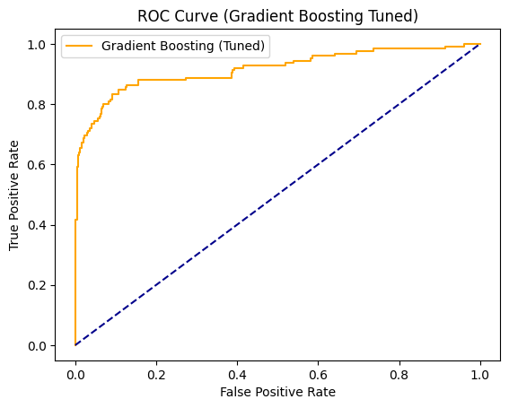

## Further Model Evaluation

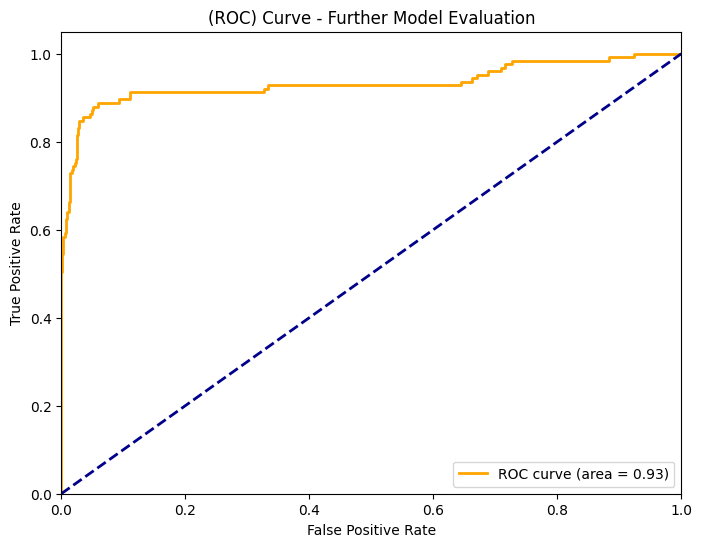

## Separate Test Validation

Accuracy: 0.9460431654676259
Precision: 0.8921568627450981
Recall: 0.728
F1-score: 0.8017621145374448
ROC-AUC Score: 0.9325133991537377

## **Possible Factors influencing Customer Churn**
**Service Quality**- Customers may churn if they experience frequent service disruptions, poor call quality, slow internet speeds, or other service-related issues. Monitoring service performance metrics and addressing any issues promptly can help retain customers.

**Competitive Pricing** - Customers may switch to competitors offering better pricing plans, discounts, or promotional offers. Conducting market research and adjusting pricing strategies to remain competitive can help prevent customer attrition due to pricing factors.

**Customer Support** -  Dissatisfaction with customer service interactions, long wait times, or unresolved complaints can drive customers to churn. Improving the responsiveness and effectiveness of customer support channels can enhance customer satisfaction and loyalty.

**Billing and Payment Issues** - Billing errors, unexpected charges, or difficulty in managing account payments can frustrate customers and lead them to consider switching providers. Streamlining billing processes and offering flexible payment options can reduce churn related to billing issues.

**Service Offerings**- Customers may churn if they find better service offerings or features elsewhere, such as unlimited data plans, international calling options, or value-added services. Continuously innovating and expanding service offerings to meet evolving customer needs can help retain customers.

**Customer Experience**- Negative experiences across touchpoints, including website usability, mobile app functionality, and store interactions, can influence customers' decisions to churn. Investing in enhancing the overall customer experience can improve satisfaction and reduce churn.

## **Conclusion & Recommendation**

**Enhance Customer Engagement**: Implement strategies to enhance customer engagement and satisfaction, such as personalized communication, proactive customer support, and loyalty programs. By fostering stronger relationships with customers, the likelihood of churn may decrease as customers feel valued and supported.

**Target Retention Campaigns**: Utilize insights from the churn prediction model to develop targeted retention campaigns aimed at at-risk customers. These campaigns can include special offers, discounts, or incentives tailored to address the specific needs or concerns of customers identified as likely to churn.

**Improve Service Quality:** Focus on improving service quality and addressing common pain points identified through customer feedback and analysis. By addressing issues related to service reliability, call quality, and customer support, SyriaTel can enhance overall customer satisfaction and loyalty, reducing the likelihood of churn.

**Proactive Customer Service**: Implement proactive customer service initiatives to address potential churn triggers before they escalate. This may involve monitoring customer behavior and engagement metrics to identify early warning signs of dissatisfaction and intervene accordingly with personalized support or solutions.

**Data-Driven Decision Making**: Continuously monitor and analyze customer data to identify trends, patterns, and factors contributing to churn. Regularly update and refine the churn prediction model based on new insights and evolving customer behavior to ensure its accuracy and effectiveness in predicting churn.

**Cross-Functional Collaboration**: Foster collaboration across departments, including marketing, sales, customer service, and data analytics, to align strategies and initiatives aimed at reducing churn. By leveraging collective expertise and resources, SyriaTel can implement cohesive and holistic approaches to customer retention.

**Customer Feedback Mechanisms**: Implement robust mechanisms for gathering and analyzing customer feedback to understand their needs, preferences, and pain points. Actively solicit feedback through surveys, reviews, and other channels, and use this information to drive continuous improvement efforts and enhance the customer experience.
